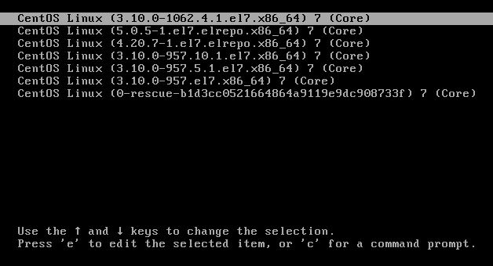
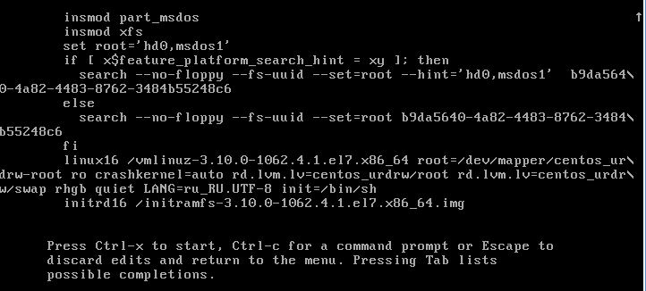
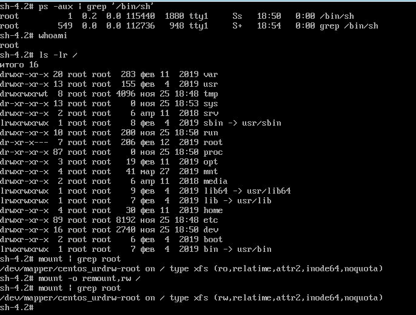

# **Домашнее задание №4: Загрузка системы**

## **Задание:**
Работа с загрузчиком
1. Попасть в систему без пароля несколькими способами
2. Установить систему с LVM, после чего переименовать VG
3. Добавить модуль в initrd

4(*). Сконфигурировать систему без отдельного раздела с /boot, а только с LVM
Репозиторий с пропатченым grub: https://yum.rumyantsev.com/centos/7/x86_64/
PV необходимо инициализировать с параметром --bootloaderareasize 1m
Критерии оценки: Описать действия, описать разницу между методами получения шелла в процессе загрузки.
Где получится - используем script, где не получается - словами или копипастой описываем действия.

## **Выполнено:**
1. Попадаем в систему без пароля несколькими способами:

    1. Способ 1. init=/bin/sh

В конце строки начинающейся с linux16 добавляем init=/bin/sh и нажимаем сtrl-x для
    загрузки в систему, т.е. сообщаем ядру запустить /bin/sh как первый процесс с PID=1.
    
    
    
    
    
    '''bash
    mount -o remount,rw /
    mount | grep root
    '''

    2. Через initrd, rd.break.
    rd.break -  даем инстукцию initrd  запустить sh перед pivot_root()

    Создание .autorelabel запускает в initrd restorecon SELinux

    3. rw init=/sysroot/bin/sh
    Аналогично 1.1
