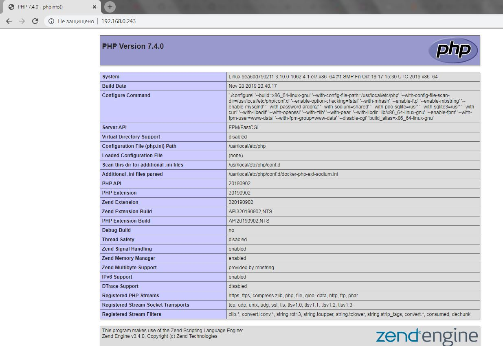

# **Домашнее задание №9: Docker**

## **Цель: Разобраться с основами docker, с образа, эко системой docker в целом.**

## **Задание:**

Создайте свой кастомный образ nginx на базе alpine. После запуска nginx должен
отдавать кастомную страницу (достаточно изменить дефолтную страницу nginx)
Определите разницу между контейнером и образом
Вывод опишите в домашнем задании.
Ответьте на вопрос: Можно ли в контейнере собрать ядро?
Собранный образ необходимо запушить в docker hub и дать ссылку на ваш
репозитори

Задание со * (звездочкой)
Создайте кастомные образы nginx и php, объедините их в docker-compose.
После запуска nginx должен показывать php info.
Все собранные образы должны быть в docker hub


## **Выполнено:**

### **1. Создан  свой кастомный образ nginx на базе alpine.**

**- Для создания образа подготовлен следующий [Dockerfile](Dockerfile).**

**- Создаем образ**
```
[root@4otus hw9]# docker build -t my-nginx-image:latest .
Sending build context to Docker daemon 7.168 kB
Step 1/5 : FROM nginx:alpine
Trying to pull repository docker.io/library/nginx ...
alpine: Pulling from docker.io/library/nginx
89d9c30c1d48: Already exists
24f1c4f0b2f4: Already exists
Digest: sha256:0e61b143db3110f3b8ae29a67f107d5536b71a7c1f10afb14d4228711fc65a13
Status: Downloaded newer image for docker.io/nginx:alpine
 ---> a624d888d69f
Step 2/5 : LABEL MAINTAINER "stump773@gmail.com"
 ---> Running in 354bb82a7647
 ---> 199182296f40
Removing intermediate container 354bb82a7647
Step 3/5 : COPY index.html /usr/share/nginx/html/index.html
 ---> d3d2fb062e96
Removing intermediate container 66c3b55440fd
Step 4/5 : EXPOSE 80
 ---> Running in 4e82d049cc8e
 ---> 28fd0fb7787c
Removing intermediate container 4e82d049cc8e
Step 5/5 : CMD nginx -g daemon off;
 ---> Running in b613e65ccc11
 ---> 3425e58babf3
Removing intermediate container b613e65ccc11
Successfully built 3425e58babf3
```        


**- Проверяем создание**
```
[root@4otus hw9]# docker images
REPOSITORY          TAG                 IMAGE ID            CREATED             SIZE
my-nginx-image      latest              3425e58babf3        2 minutes ago       21.5 MB
docker.io/nginx     alpine              a624d888d69f        2 weeks ago         21.5 MB
```

**- Проверяем работу**
```
docker run -d -p 80:80 stump773/my-nginx-image
docker ps
[root@4otus hw9]# curl localhost
<html>
<head>
<title>Welcome Homework №9</title>
</head>
<body>
<h1>Welcome Homework №9 </h1>
</body>
</html>
```

**- Выкладываем в [Docker Hub](https://hub.docker.com/repository/docker/stump773/my-nginx-image)**
```
docker login
docker push stump773/my-nginx-image
```


### **2. Выводы про разницу между контейнером и образом:**
Образ докера являются основой контейнеров. Образ - это упорядоченная коллекция изменений корневой файловой системы и соответствующих параметров 
выполнения для использования в среде выполнения контейнера. 
Образ обычно содержит объединение многоуровневых файловых систем, расположенных друг на друге. Образ не имеет состояния и никогда не изменяется.
**Контейнер - это исполняемый(остановленный) экземпляр образа docker.** 
Контейнер Docker состоит из
- Docker образа 
- Среды выполнения
- Стандартного набора инструкций
Концепция заимствована из морских контейнеров, которые определяют стандарт для доставки товаров по всему миру. 
Docker определяет стандарт для отправки программного обеспечения.

Взято из [Docker Glossary](https://docs.docker.com/glossary/)

Хотелось бы еще добавить, что из одного образа можно запустить множество контейнеров.

### **3. Ответьте на вопрос: Можно ли в контейнере собрать ядро?**

- Собрать возможно - [https://github.com/moul/docker-kernel-builde](https://github.com/moul/docker-kernel-builder). 
 Загрузиться вряд ли получится )


### ** /* **

- Создан [Dockerfile](./nginx-php-fpm/php-fpm/Dockerfile) для создания контейнера с php-fpm
- Создан [docker-compose.yml](./nginx-php-fpm/docker-compose.yml)
- Запускаем и проверяем
```
[root@4otus nginx-php-fpm]# docker-compose up

Starting nginxphpfpm_web_1 ... doneone
Attaching to nginxphpfpm_phpfpm_1, nginxphpfpm_web_1
phpfpm_1  | [12-Dec-2019 15:58:22] NOTICE: fpm is running, pid 1
phpfpm_1  | [12-Dec-2019 15:58:22] NOTICE: ready to handle connections
phpfpm_1  | 172.19.0.3 -  12/Dec/2019:15:58:31 +0000 "GET /index.php" 200
web_1     | 192.168.0.100 - - [12/Dec/2019:15:58:31 +0000] "GET / HTTP/1.1" 200 74303 "-" "Mozilla/5.0 (Windows NT 6.1; Win64; x64) AppleWebKit/537.36 (KHTML, like Gecko) Chrome/78.0.3904.108 Safari/537.36" "-"
^CGracefully stopping... (press Ctrl+C again to force)
Stopping nginxphpfpm_phpfpm_1 ... done
Stopping nginxphpfpm_web_1    ... done
```



### ***Полезные команды:***
```
docker ps -a
docker inspect [OPTIONS] NAME|ID [NAME|ID...]
docker exec -it NAME|ID /bin/sh
docker logs NAME|ID
docker rm $(docker ps -aq)
docker run NAME --restart always#стартовать контейнер после перезагрузки хоста
docker run NAME --rm #удаление контейнера после остановки
docker network create BRIDGE_NAME
docker network ls
```


 


